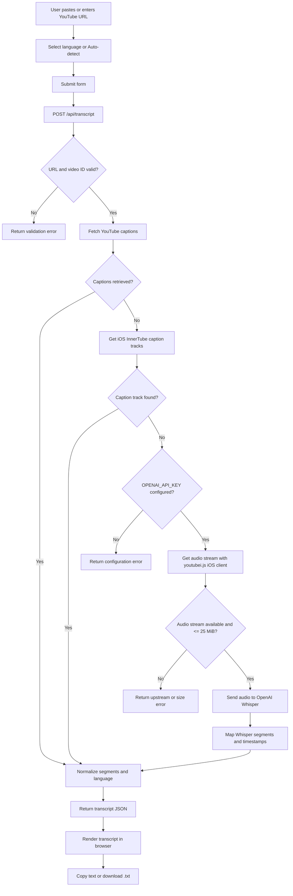
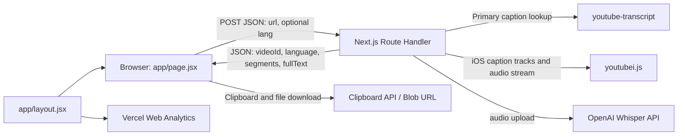

# YouTube Transcript Project Guide

## Overview

This is a Next.js App Router application that accepts a YouTube video URL and returns a timestamped transcript. It prefers existing YouTube captions, trying the standard caption lookup first and then an iOS InnerTube caption-track lookup. If both caption sources fail, it attempts to download audio and transcribe it with OpenAI Whisper.

The app does not use a database or persist transcripts. The audio fallback sends the selected video audio to OpenAI for transcription.

## Features

- Accepts standard `youtube.com` and `youtu.be` links, including Shorts, embeds, live links, and a bare 11-character video ID.
- Lets the user paste a link from the clipboard.
- Supports automatic caption language selection, English (`en`), Hindi (`hi`), and Gujarati (`gu`). Other language codes can be sent through the API.
- Displays transcript segments with timestamps, the video ID, detected/requested language, and whether audio transcription was used.
- Copies the complete transcript to the clipboard.
- Downloads timestamped transcript text as a `.txt` file.
- Shows request progress and user-facing validation, clipboard, API, and transcription errors.
- Includes Vercel Web Analytics in the root layout.

## Request Flow



## Component Map



## Transcript API

### `POST /api/transcript`

Request body:

```json
{
  "url": "https://youtu.be/VIDEO_ID",
  "lang": "hi"
}
```

`lang` is optional. When omitted, the captions library selects the available/default track. The UI offers `en`, `hi`, and `gu` in addition to automatic selection.

Successful response shape:

```json
{
  "videoId": "VIDEO_ID",
  "language": "en",
  "segments": [
    { "start": 1.2, "duration": 2.4, "text": "Example speech." }
  ],
  "fullText": "Example speech."
}
```

Audio-based responses also include `"source": "audio"`. Caption times are converted from milliseconds to seconds. Whisper segment start/end times are converted to a start and duration.

## Audio Fallback

Audio fallback is attempted only after both caption sources fail:

1. Confirm `OPENAI_API_KEY` is configured.
2. Create a `youtubei.js` `Innertube` client with player retrieval disabled.
3. Request video information with the `IOS` client and choose the best audio format.
4. Read the audio stream into memory, stopping if it exceeds 25 MiB.
5. Send the audio file to OpenAI `whisper-1` with `verbose_json` response format.
6. Return Whisper's transcript segments and detected language in the same response shape as caption-based results.

Audio fallback depends on YouTube allowing the server to retrieve the media stream. YouTube may restrict requests from cloud-hosting IPs; metadata being available does not guarantee that the audio stream can be downloaded. Captions are therefore the preferred path.

## Project Structure

```text
app/
  api/
    transcript/
      route.js       POST endpoint, URL validation, captions, audio fallback
  globals.css        Tailwind directives and global font rules
  layout.jsx         Root HTML layout, metadata, Vercel Analytics
  page.jsx           Client UI and transcript display/actions
package.json         Scripts and runtime/development dependencies
package-lock.json    Locked npm dependency versions
next.config.js       Next.js configuration
postcss.config.js    PostCSS/Tailwind processing
tailwind.config.js   Tailwind theme/content configuration
```

The active Next.js routes and UI are in `app/`. Root-level files with names like `page.jsx`, `layout.jsx`, and `route.js` are not the App Router files; make application changes in the corresponding `app/` files.

## Technology and Packages

### Runtime dependencies

| Package | Purpose |
| --- | --- |
| `next` | App Router, React rendering, API Route Handler, build and server runtime |
| `react`, `react-dom` | UI and client-side interaction |
| `youtube-transcript` | Retrieves existing caption segments without an API key |
| `youtubei.js` | Retrieves iOS caption tracks and YouTube video metadata/audio for fallback paths |
| `openai` | OpenAI client used to submit audio to Whisper |
| `@vercel/analytics` | Vercel Web Analytics component in the root layout |

### Development dependencies

| Package | Purpose |
| --- | --- |
| `tailwindcss` | Utility CSS used by the UI |
| `postcss` | CSS processing pipeline |
| `autoprefixer` | Adds browser CSS prefixes during processing |

`youtube-dl-exec` and `@distube/ytdl-core` were removed. The first required a Python executable in the serverless runtime; the second did not return playable formats in testing.

## Environment and Commands

Create `.env.local` for local development:

```env
OPENAI_API_KEY=your_openai_api_key
```

The key is only needed for audio fallback; caption retrieval does not require it. Add the same variable to the Vercel project's Environment Variables for the deployment environments that need audio fallback. Never commit the key.

```bash
npm install
npm run dev
npm run build
npm start
```

The API route uses the Node.js runtime and declares a maximum function duration of 60 seconds. The OpenAI audio upload limit enforced by the route is 25 MiB.

## Observability and Privacy

- Caption-fetch errors are logged with the video ID, error name/message, and status.
- Audio errors are logged with a message, status, and error type. Signed media URLs are not logged.
- No transcript database or persistence layer is implemented.
- The browser's transcript text is copied or downloaded locally. Audio fallback sends audio to OpenAI for processing.
- Enable Web Analytics for the Vercel project in its dashboard; adding the component to the layout alone does not enable collection.

## Verification Status

The latest `npm run build` completed successfully. Local checks confirmed that `youtube-transcript` can retrieve captions for tested public videos. For `EEPKv7ciUQY`, the iOS InnerTube caption-track fallback also parsed 45 Hindi segments. Cloud-hosted caption and audio access still depends on YouTube's response to the Vercel function's requests; redeploy and inspect the caption-fallback log to verify production behavior.
